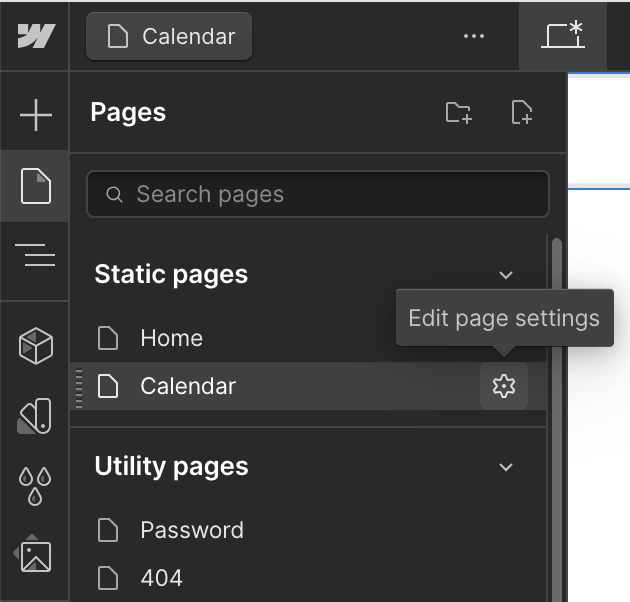
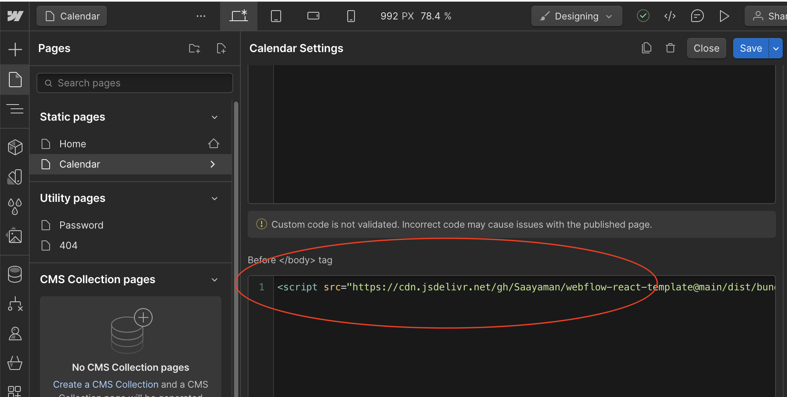

# WEBFLOW REACT TEMPLATE

The walkthrough below will demonstrate how to build and create CDN for a react project and integrate it in webflow.
This is a template for a lightweight react project for creating small components, referenced from [here](https://webflow.com/blog/react-components-in-webflow).

Also a Github Actions is added to build the project in the `PRIVATE REPO` and copy it in another existing Github `PUBLIC` Repository.

## Step 1: Replace default names

1. Title: Change the <title> inside `index.html`
2. Target ID: Change the div ID `react-target` inside `dist/index.html` and `src/index.js` to whatevere ID name you like


## Step 2: Write the react code

1. Run `npm start` and check your app in `http://localhost:3000`
2. Inside `src/index` replace inside the `return()` to your code

## Step 3: Push Code to Github

Before you push to github,
1. Create a PUBLIC repository
2. Change the credentials for the `node.js.yml` file.
3. Once all the code is done, put your code to github
```
git add.
git commit -m "comment"
git push origin main
```
4. When code is pushed to github, `node.js.yml` will start their job automatically
- It will install packages and build a bundle.js file
- It will copy the bundle file to another repository

## Step 4: Create CDN

1. Get the URL of the `bundle.js` file inside of your github repo.
It should look similar to this
```
https://github.com/<YOUR_GITHUB_ACCOUNT>/<YOUR_REPO_NAME>/blob/main/dist/bundle.js
```
2. Go the website [https://www.jsdelivr.com/github](https://www.jsdelivr.com/github).
Paste the Github link above, and copy the jsDeliver link generated

## Step 5: Read the bundle file inside Webflow

1. Inside your webflow project, create a empty div and put the `target ID` name that you chose in [Step 1](#step-1-replace-default-names).

2. Inside the page you created the empty div, click Settings button with the gear icon
<br />
3. Scroll down and find the `before </body> tag` section, and paste the jsDeliver link.
<br />

4. Publish and access the page you put your script.
5. The React app should be showing inside your webflow app.
